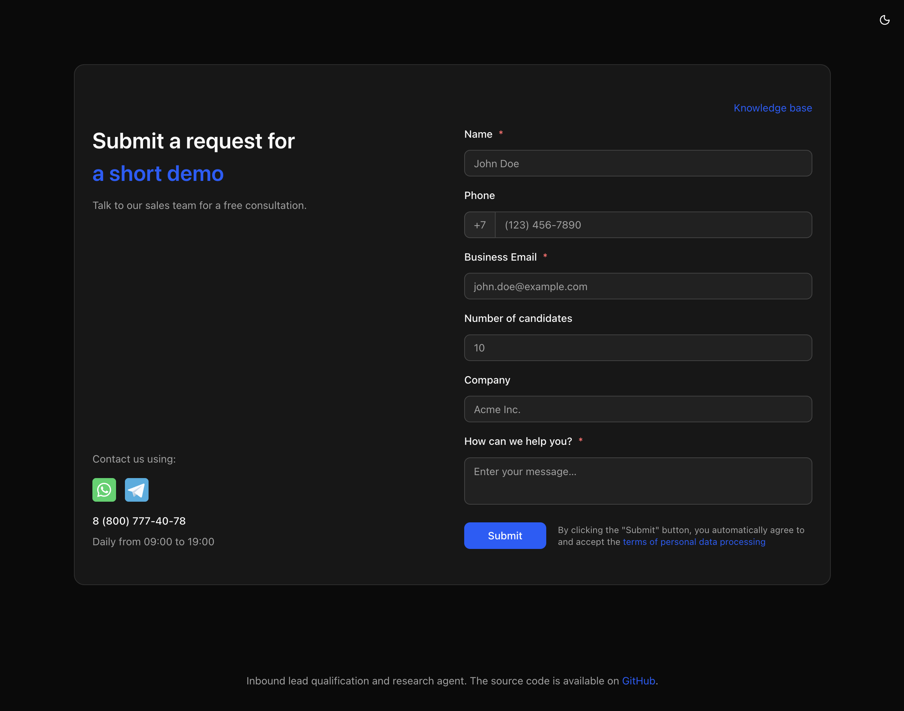

<a href="lead-agent-form.vercel.app">
  
  <h1 align="center">Lead Agent</h1>
</a>

<p align="center">
  Lead qualification and research agent built with Next.js, AI SDK, Workflow DevKit, and Telegram Bot API.
</p>

The agent captures a lead in a contact sales form and then kicks off a qualification workflow. It integrates with Telegram to send and receive messages for human-in-the-loop feedback.

<p align="center">
  <a href="#features"><strong>Features</strong></a> ·
  <a href="#model-provider"><strong>Model providers</strong></a> ·
  <a href="#deploy-your-own"><strong>Deploy your own</strong></a> ·
  <a href="#running-locally"><strong>Running locally</strong></a>
</p>
<br/>

## Features

- [Next.js](https://nextjs.org) App Router
  - Advanced routing for seamless navigation and performance
  - React Server Components (RSCs) for server-side rendering and increased performance
- [Vercel AI SDK](https://ai-sdk.dev/) Integration
  - AI SDK Agent class for autonomous research capabilities
  - Direct API calls for text generation and other AI features
- [Workflow DevKit](https://useworkflow.dev/) Integration
  - Durable execution with `use workflow` for reliable background tasks
  - Sequential workflow steps for lead processing pipeline
- [Exa.ai](https://exa.ai/) Integration
  - Advanced web search capabilities for comprehensive lead research
  - Enhances the AI's ability to gather information about lead companies
- [Telegram Bot API](https://core.telegram.org/bots/api)
  - Human-in-the-loop approval workflow
  - Real-time notifications for lead qualification results
- [Shadcn/ui](https://ui.shadcn.com)
  - Styling with [Tailwind CSS](https://tailwindcss.com)
  - Component primitives from [Radix UI](https://radix-ui.com) for accessibility and flexibility

## Model providers

This app utilizes the [OpenAI API](https://openai.com/) through [Vercel AI Gateway](https://vercel.com/ai-gateway) for its AI capabilities. It is configured to use OpenAI models for generating responses and conducting research.

## Deploy your own

You can deploy your own version of Lead Agent to Vercel with one click:

[](https://vercel.com/new/clone?repository-url=https%3A%2F%2Fgithub.com%2Fvercel-labs%2Flead-agent&env=AI_GATEWAY_API_KEY,TELEGRAM_BOT_TOKEN,TELEGRAM_CHAT_ID,EXA_API_KEY&envDescription=Learn%20more%20about%20how%20to%20get%20the%20API%20Keys%20for%20the%20application&envLink=https%3A%2F%2Fgithub.com%2Fvercel-labs%2Flead-agent%2Fblob%2Fmain%2F.env.example&demo-title=Lead%20Agent&demo-description=An%20inbound%20lead%20qualification%20and%20research%20agent%20built%20with%20Next.js&demo-url=https%3A%2F%2Flead-agent-form.vercel.app)

## Running locally

You will need to use the environment variables [defined in `.env.example`](.env.example) to run Voice. It's recommended you use [Vercel Environment Variables](https://vercel.com/docs/projects/environment-variables) for this, but a `.env` file is all that is necessary.

> Note: You should not commit your `.env` file or it will expose secrets that will allow others to control access to your various OpenAI and authentication provider accounts.

1. Install Vercel CLI: `npm i -g vercel`
2. Link local instance with Vercel and GitHub accounts (creates `.vercel` directory): `vercel link`
3. Download your environment variables: `vercel env pull`

```bash
bun install
bun dev
```

Your app should now be running on [localhost:3000](http://localhost:3000/).